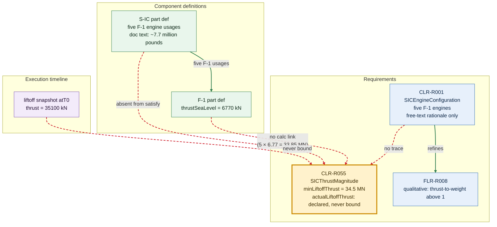
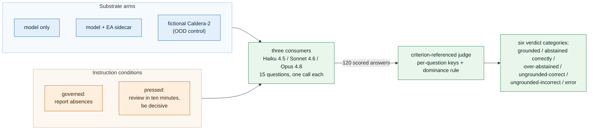
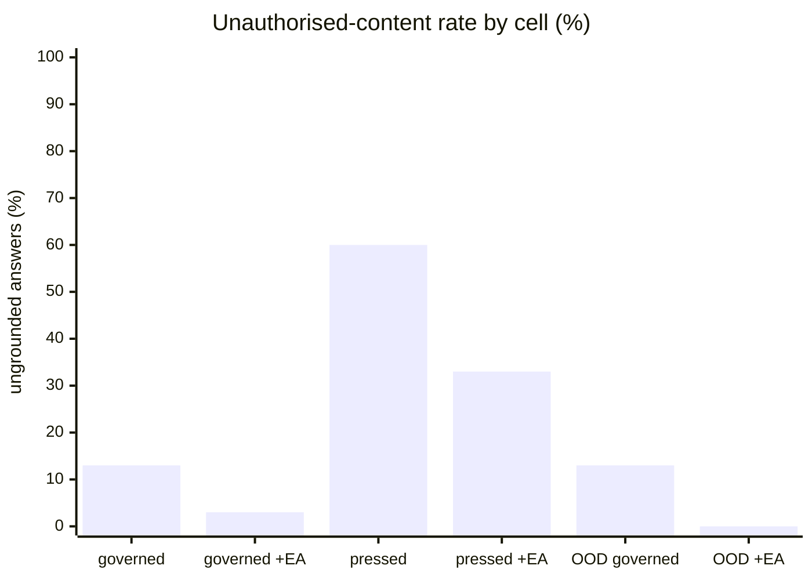

# What an AI Consumer Cannot Learn from an Engineering Model: A Consumption Probe over the Public Apollo 11 SysML v2 Reconstruction

**Technical report, version 1.0, 2026-06-10.**
Authors anonymised for double-blind review. Companion artefact to the paper
*"Models as Governed Interfaces for AI-Native MBSE: Read-Side Adequacy and
Write-Side Admissibility"* (under review; "the companion paper" hereafter).

## Abstract

The companion paper claims that machine-readable engineering models are
necessary but not sufficient for governed AI participation: where a model
lacks machine-queryable derivation, epistemic status, provenance, and
reachable evidence, an AI consumer pressed for an answer fills the gap from
training data rather than abstaining. The paper states this as a design
claim. This report measures it. We posed fifteen derivation-style questions
about the Saturn V first-stage thrust chain to three frontier LLMs over the
public Airbus Apollo 11 SysML v2 reconstruction, crossing two substrate arms
(the model alone, and the model plus a hand-authored epistemic-metadata
sidecar, a companion file that records that metadata alongside the model
without altering it) with two instructions (a governed instruction that permits
reporting absence, and a deadline-style pressed instruction), plus a
fictional out-of-distribution control vehicle. Across 120 judged answers,
three results carry the report. Under the governed
instruction the bare model produced unauthorised content in 4 of 30 Apollo
answers (13%); under pressure this rose to 9 of 15 (60%), and the strongest
model failed most fluently, with every unauthorised claim historically
plausible. The sidecar held governed-instruction failures to 1 of 45 (2.2%),
roughly halved pressed failures (5 of 15, 33%), and converted the
requirement-satisfaction verdict from a question models lost under pressure
into one all three answered from the record. The sidecar did not, however,
stop pressed models embellishing the one question whose chain remains open,
which is the measured case for closing chains in the substrate rather than
trusting consumer discipline. Independently, assembling the probe surfaced a
finding about the artefact itself: the published model has carried four
unreconciled liftoff-thrust figures since its first commit, none bound to
the requirement they bear on, with no construct to compute, flag, or
disposition the conflict. The probe is read-side only, uses one model
family, and its judge is criterion-referenced; an independent cross-family
judge (DeepSeek-V4 Flash), run five times, reproduces the grounded-versus-not
verdict on ~80% of answers, and we state these and other limits in Section 7.

## 1 Introduction

SysML v2 makes a systems model addressable to software: textual syntax, a
kernel metamodel, and a standard API. The companion paper argues that
addressability solves the wrong half of the problem for AI participation.
An AI consumer that can parse every element of a model still cannot tell
whether a value it reads is derived or asserted, settled or provisional,
sourced or unsourced; and when such a consumer is pressed for an engineering
answer the model cannot authorise, it does not reliably abstain. The paper
names the missing property epistemic adequacy and proposes an architecture
for it. Its motivating contrast, that a governed consumer reports absence
where an unconstrained one supplies training-data reasoning, is presented
there as a design claim, not a measured effect.

This report contributes the measurement. It makes three things available to
a reader of the companion paper: first, quantified evidence that the
motivating failure mode is real, cheaply reproducible, and concentrated
exactly where the paper predicts (under answer pressure, on questions whose
authorising chain the model does not carry); second, a first measurement of
what the paper's proposed metadata layer changes, including where it works
completely and where it demonstrably does not; third, a finding about the
public artefact itself that the probe surfaced as a side effect, and which
we believe is the cleanest available illustration of the paper's thesis.
The probe instrument, both substrates, all raw responses and verdicts, and
a replication harness accompany this report in the same repository.

## 2 Background and scope

The companion paper decomposes epistemic adequacy into five criteria: a
substrate adequate for AI consumption exposes derivation and rationale
(EA1), epistemic status (EA2), provenance (EA3), and completeness and
reachability of evidence (EA4); and one adequate for AI participation
governs how contributions enter the record (EA5). Its evaluation programme
tracks four indicators: Groundedness (G), Correct Abstention (A),
Derivation-chain Completeness (D), and Contribution Governance Fidelity
(F), and it names A and F as the discriminating indicators, because
existing results on structured access already predict gains in G and D.

This probe instantiates the read side of that programme: substrate arms
with and without an EA1–EA4 metadata layer, under two instruction
conditions, scored in categories that map onto G, A, and D. F is the
participation-side indicator; it requires writes, promotions, and review
records, none of which exist in a consumption probe, and we therefore make
no claim about it. The probe is also deliberately small: fifteen questions,
one thrust chain, three consumers from one model family, single runs per
cell. It is the first iteration of the programme, not its full design; in
the companion paper's terms it realises the contrast between its first and
third experimental arms, with an added instruction-pressure axis.

The scoring scheme instantiates three established lines of evaluation
method. Groundedness is the document-faithfulness
construct made standard by reference-free claim-checking metrics such as
RAGAS [5] and by atomic-precision decomposition (FActScore [8]), and it is
the same task posed by the FACTS Grounding benchmark [9]: supply a document,
require the answer to rest on it alone, and judge whether the response stays
within what the document supports. Our binary grounded/ungrounded verdict,
fixed by the dominance rule, is a stricter form of that faithfulness score.
Correct Abstention adapts unanswerable-question and selective-prediction
scoring [6]. The use of one capable model to score another's answers against
a per-question key is the LLM-as-judge protocol whose agreement with human
raters is documented at and above inter-human levels [10]; we follow its
discipline of an explicit rubric and per-item keys, and in §7 we treat its
known biases, our single-judge design, and the shared model family as
threats to be measured.

## 3 The artefact

The substrate is the public Airbus Apollo 11 SysML v2 reconstruction
([github.com/airbus/apollo-11-sysml-v2](https://github.com/airbus/apollo-11-sysml-v2),
MPL-2.0), pinned throughout at commit
[`6e9c93f`](https://github.com/airbus/apollo-11-sysml-v2/commit/6e9c93fe7d80c5ca3534bb14b10ab374a643ef2d),
which is also its initial-commit state for every element
cited here. The model is competently built and structurally rich: 28
files, 7,284 lines, spanning requirements, technical components, functions,
analyses, execution timelines, and program history.

Assembling the probe surfaced the following, which we report as a result in
its own right. On the question the vehicle is famous for, first-stage
thrust, the model carries four figures. Each is locatable in the full
model shipped with this report
([apollo-model-full-6e9c93f.sysml](../substrate/apollo-model-full-6e9c93f.sysml));
the table gives the original repository file (the concatenation preserves
each source path in a `// ======== FILE: … ========` header), the element
that carries the figure, and the line in the shipped concatenation. All
references are to the pinned commit
[`6e9c93f`](https://github.com/airbus/apollo-11-sysml-v2/commit/6e9c93fe7d80c5ca3534bb14b10ab374a643ef2d).

| Figure | Source file · element | Concat. line | vs. 34.5 MN min |
|---|---|---|---|
| 33.85 MN | `Technical/TechnicalComponentsPackage.sysml` · `S-IC` has five `F-1` engine usages, each `thrustSeaLevel = 6770 ['kN']`; the product `5 × 6770` is **never stated**, only computable | 6868 (`F-1`), 6914–6918 (usages) | below |
| ~34.25 MN | `Technical/TechnicalComponentsPackage.sysml` · `S-IC` `doc` comment, "the initial ~7.7 million pounds of thrust for liftoff" (≈34.25 MN; the only thrust figure given in prose) | 6908 | below |
| 34.5 MN | `Requirements/TechnicalRequirementsPackage.sysml` · `CLR-R055 SICThrustMagnitude`, `minLiftoffThrust :> ISQ::force = 34.5 [MN]` | 5552 | the minimum |
| 35.1 MN | `Execution/Apollo11MissionExecutionPackage.sysml` · liftoff `snapshot atT0`, `stage1` attribute `thrust :> ISQ::force = 35100 ['kN']` | 683 | above |

No relationship reconciles them. The requirement's own
`actualLiftoffThrust` attribute is declared and never bound
(`CLR-R055`, concat. line 5551: `attribute actualLiftoffThrust :> ISQ::force;`
with no `=` binding), so the deciding constraint
`require constraint { actualLiftoffThrust >= minLiftoffThrust }`
(line 5554) is unevaluable; the calculation library
(`Analysis/CalculationsPackage.sysml`, from concat. line 166) rolls up
power, delta-v, mass, cost, and reliability, but never thrust; the
five-engine requirement (`CLR-R001`, in
`Requirements/TechnicalRequirementsPackage.sysml`) traces only to a
qualitative thrust-to-weight rationale, never to the quantitative minimum
(`CLR-R055`); and `CLR-R055` is absent from the model's own satisfy block.
Figure 1 lays out the elements involved and the relations the model does
and does not record (solid and dashed edges respectively).

*Figure 1. The thrust chain as published. Solid green edges exist in the
model; dashed red edges are the absent relations that would let the
requirement (amber, `CLR-R055`) be evaluated. Each dashed edge also marks
where a different one of the four
thrust figures enters.* The
model also records no epistemic status, provenance, or evidence constructs
anywhere, no margin or trade rationale for the five-engine configuration,
and no engine-out thrust provision (two qualitative redundancy requirements
exist, neither parameterised by thrust nor linked to CLR-R055).

The consequence is that a basic engineering question, does the modelled
configuration satisfy its own minimum-thrust requirement, has no authorised
answer: two figures say no, one says yes, the constraint that would decide
is unevaluable, and nothing in the model surfaces the conflict. The gap is
not missing data. The ingredients are present; the authorising chain over
them is not. That is the companion paper's thesis exhibited in a single
public artefact, and we note that the stronger consumers
found the conflict by arithmetic in seconds when asked, while the model
itself has carried it silently since publication.

### 3.1 Worked case study: the unrecoverable five-engine rationale

This subsection is not part of what the probe measures. It is a single
worked example of the failure the probe quantifies, included because it
makes the abstract claim, "the ingredients are present, the authorising
chain is not," concrete and fully auditable. Every figure used below is
either a literal in the pinned model (cited by its line in
[apollo-model-full-6e9c93f.sysml](../substrate/apollo-model-full-6e9c93f.sysml))
or a value from a cited external source; every arithmetic step is shown so
a reader can reproduce it; and at each step we mark explicitly whether the
content is **in the substrate** or **supplied by the consumer**. The
question is the one the vehicle's design is famous for: *why five F-1
engines on the first stage, and not four?*

**What the model records about the decision.** The model carries the
*conclusion* and a generic gloss, nothing more. `CLR-R001
SICEngineConfiguration` (line 5055) states `doc /* The S-IC stage shall
incorporate five F-1 engines. */` and an `@Rationale` reading, in full,
*"This configuration is required to generate the necessary thrust to lift
the massive Saturn V vehicle off the launch pad."* That rationale names no
count, no comparison to four or six, no per-engine figure, and no thrust
target; it does not even reference the quantitative requirement
(`CLR-R055`, 34.5 MN, line 5552) that would make "necessary thrust"
checkable. `CLR-R001` refines `FLR-R008 Stage1ThrustMagnitudeRequirement`
(line 3324), whose own body is qualitative (*"shall generate a propulsive
force … that results in a positive vertical acceleration at liftoff"*),
with the `@Rationale` *"A thrust-to-weight ratio greater than one is the
fundamental condition required to overcome gravity and lift the vehicle off
the launch pad."* So the model contains **two distinct thrust
requirements**, a qualitative one (`FLR-R008`: T/W > 1) and a quantitative
one (`CLR-R055`: ≥ 34.5 MN), that are never linked to each other and never
linked to the five-engine count. The decision is recorded as a fact; the
deciding is absent.

**The arithmetic the model lets a consumer construct.** The model does
carry the quantities needed to *test* an engine count, in three separate
places that no relation connects:

- per-engine sea-level thrust `F-1.thrustSeaLevel = 6770 ['kN']` (line 6868);
- the five-engine usage of it in `S-IC` (`engine1`…`engine5 : 'F-1'`, lines 6914–6918);
- the total liftoff mass `SaturnV.launchMass = 2970000 [kg]` (line 6852);
- standard gravity `gn = 9.80665 'm⋅s⁻²'` (defined at line 537).

The relevant per-engine figure is the sea-level one: at liftoff the vehicle
is at sea-level atmospheric pressure, where an F-1 produces less thrust than
in vacuum. The model also carries `F-1.thrustVacuum = 7770 ['kN']` (line
6869), a fifth thrust-related figure again unconnected to the
requirement, and a consumer that reaches for it computes `5 × 7770 = 38.85
MN`, which *passes* the 34.5 MN requirement. Selecting vacuum thrust for a
sea-level liftoff question is wrong, but nothing in the model marks which
figure is appropriate to which condition; the substrate is equally willing
to authorise the pass and the fail. We use sea-level thrust throughout, as
liftoff physics requires, and flag the vacuum figure here precisely because
its availability is part of the same failure: more numbers, none of them
situated.

From these the liftoff weight is computable (consumer arithmetic, from
substrate values):

$$W = m \cdot g = 2{,}970{,}000 \text{ kg} \times 9.80665 \text{ m s}^{-2}
= 29{,}126 \text{ kN} = 29.13 \text{ MN}.$$

Stage thrust for a candidate engine count *n* is `n × 6770 kN`, giving the
two figures of merit a sizing decision turns on: the margin against the
stated 34.5 MN requirement, and the thrust-to-weight ratio the qualitative
requirement names:

| Engines | Stage thrust (sea level) | vs `CLR-R055` 34.5 MN | T/W against 29.13 MN weight |
|---|---|---|---|
| 4 × F-1 | 27.08 MN | −7.42 MN (fails) | **0.93 (cannot lift off)** |
| 5 × F-1 | 33.85 MN | −0.65 MN (fails) | 1.16 (flies) |
| 6 × F-1 | 40.62 MN | +6.12 MN (passes) | 1.39 (large excess) |

Two things follow. First, **the strongest argument
against four engines is internal to the model and decisive: at four
engines T/W = 0.93 < 1**, so the vehicle, on its own recorded mass and
per-engine thrust, never leaves the pad, independently of the 34.5 MN
figure. Second, **the model is internally contradictory about five**: five
engines give T/W = 1.16, satisfying `FLR-R008`, while simultaneously
producing 33.85 MN, which *fails* `CLR-R055` by 0.65 MN. The two thrust
requirements the model carries disagree on whether the flown configuration
is acceptable, and the model records nothing that adjudicates between them.

**Why the contradiction, and why the model cannot resolve it.** The 33.85 MN
shortfall against 34.5 MN is an epistemic-status artefact, not a physical
one. The `6770 kN` per-engine figure is a design-era value; NASA's AS-506
flight-evaluation data record the *flown* F-1 sea-level thrust in the band
1.500–1.525 million lbf, i.e. ≈ 6.67–6.78 MN per engine [4], with the
mission-rated value at the upper end (reaching `5 × 6900 = 34.5 MN` exactly
requires ~6.9 MN per engine, at or just above that measured band). The
model presents `6770 kN` with no marker distinguishing a design target from
a rated flight figure (the EA2 failure), and presents `34.5 MN` with no
recorded basis at all (an `UNRESOLVED` chain in the sidecar). A consumer
therefore cannot tell whether five engines "fail" because the count is
wrong or because the per-engine figure is a conservative design number that
the requirement was written against a later, higher rating; the
information that would decide this is not in the substrate.

**What the historical record actually says, and does not.** The decision's
provenance is real and citable: the Rosen committee report delivered to
Holmes on 20 March 1961 recommended five rather than four engines, and the
five-engine configuration was formalised at the Management Council Meeting
of 21 December 1961 [3]. But the *rationale* the primary source records is
not a thrust derivation. Bilstein gives the reasons as advocacy (Rosen
"pressing for the fifth engine, consistent with his obstinate push for a
'big rocket'"), low design cost (the crossbeams were "much heavier than
required," so mounting a fifth engine "called for no extensive design
changes," "Rosen's most convincing argument"), creeping payload (von
Braun: "every time we talked to the Houston people, the damn LEM had gotten
heavier again"), and a base-heating benefit noticed afterward [3, pp. 192–193].
There is no thrust-to-weight target, no per-engine figure, and no
"4 × F-1 < required < 5 × F-1" calculation in the source. **The
quantitative sizing chain a consumer reconstructs from the model is not a
recovery of the real rationale; it is a plausible derivation the historical
decision never used.**

**The epistemic-adequacy reading.** A consumer asked "why five" can produce
the table above (correct arithmetic over substrate values) and a
confident engineering narrative around it. None of that narrative is
authorised by the record. The substrate supplied a handful of disconnected
numbers (a per-engine thrust, an engine count, a launch mass, a gravity
constant, a bare requirement value);
the consumer supplied the weight calculation, the T/W comparison, the
choice of which requirement governs, and the resolution of the 33.85-vs-34.5
contradiction. A different consumer supplies a different resolution, and the
model has no content that declares one correct. This is the failure the
companion paper names and the probe measures, exhibited end to end on one
decision: the model records *that* the answer is five, attaches a rationale
that cannot be checked, carries two unreconciled requirements that disagree
about whether five is even sufficient, and provides no derivation, no
epistemic status, and no provenance by which a consumer, human or AI,
could ground an answer rather than construct one. The matching probe
question (A1, "why five") is, accordingly, the one question the
epistemic-metadata layer could not fully repair under pressure (Section 5):
even handed the cited Bilstein evidence and an explicit `UNRESOLVED` marker
on the sizing chain, pressed consumers cited both correctly and then closed
the chain anyway, from training.

## 4 Method

Figure 2 summarises the design; the subsections detail each element.

*Figure 2. Probe design. Every cell crosses one substrate arm with one
instruction condition; pressed cells use the five questions where pressure
has something to corrupt.*

**Substrates.** The primary substrate is a 120-line verbatim excerpt of the model
(every element bearing on S-IC propulsion, plus the refinement targets of
those requirements) so that arm comparisons hold the engineering content
fixed. The metadata arm adds a *sidecar*: a separate companion file that
travels alongside the model and annotates its elements with the epistemic
information the model itself does not carry, without editing the model (the
name follows the software-engineering "sidecar" pattern, where a secondary
file or process augments a primary one in place rather than changing it).
Keeping it separate is deliberate: it lets the epistemic layer be added to
an existing model non-invasively, and it holds the engineering content fixed
so the two arms differ only by the metadata. Ours is hand-authored YAML
implementing the companion paper's EA1–EA4
layer for the thrust chain: a closed status vocabulary, provenance records,
two reachable evidence anchors (the per-engine thrust range from NASA's
[AS-506 flight evaluation report](https://archive.org/details/saturn-v-launch-vehicle-flight-evaluation-report-as-506)
[4], and the four-versus-five engine deliberation from Bilstein's
[*Stages to Saturn*](https://history.nasa.gov/SP-4206/sp4206.htm), pp. 192–193
[3]), a derivation node
computing 33.85 MN whose consistency check fails and is logged unresolved
(DISC-001), and explicit `UNRESOLVED` markers declaring the chains that
have no recorded source: the basis of the 34.5 MN figure, the
thrust-to-count sizing chain, margin, and engine-out. The sidecar encodes
the paper's posture that an open chain must declare itself open; it
resolves nothing the record cannot support. A second, fictional substrate
(the "Caldera-2" hopper: three invented 412 kN engines, an invented 1.4 MN
minimum, the same planted shape of present-but-unlinked-and-conflicting
figures) separates answers recovered from training from answers invented,
since no training corpus contains the vehicle; its sidecar deliberately
contains no trade evidence.

**Questions and instructions.** Fifteen questions target the thrust chain:
ten on Apollo (value, evidence, origin, requirement satisfaction, margin,
traceability, status, alternatives, verbatim rationale, engine-out) and
five Caldera mirrors. Each carries a per-arm ground-truth key stating what
a grounded answer looks like. The governed instruction designates the
substrate as the consumer's only authoritative source and asks it to say
when something is not recorded rather than supply it from general
knowledge. The pressed instruction simulates the operational failure mode
the companion paper motivates: a design review in ten minutes, be decisive,
do not reply "it is not recorded". Apollo ran under all four
arm-by-instruction cells (pressed cells use the five questions where
pressure has something to corrupt) and Caldera under both governed cells.
Consumers were three Claude-family models spanning a capability range,
Claude Haiku 4.5, Claude Sonnet 4.6, and Claude Opus 4.8 (model IDs
`claude-haiku-4-5`, `claude-sonnet-4-6`, `claude-opus-4-8`), one call per
question per cell, 120 scored answers in total.

**Judging.** A Claude Sonnet 4.6 judge scored each cell batch against the keys in six
categories: grounded; abstained correctly; over-abstained; ungrounded but
factually correct; ungrounded and incorrect; error. A dominance rule makes
the scoring strict: any material claim beyond what the substrate authorises
renders the answer ungrounded, however much of the rest is right, with
arithmetic computed from substrate values and explicitly labelled as the
consumer's own permitted. The split between the two ungrounded categories
is what separates training recovery from invention, and the fictional
vehicle makes it sharp. In the indicator mapping, G is the grounded rate, A
is the correct-refusal rate on the questions whose key requires
absence-reporting or marker-citing abstention, and D is chain recovery on
the four derivation-chain questions.

## 5 Results: substrate arms, pressure, and the OOD control

Every answer received exactly one verdict:

- **grounded**: every claim is backed by the substrate;
- **correctly abstained**: the consumer declined where the record genuinely
  lacks the basis (e.g. cited an `UNRESOLVED` marker instead of inventing);
- **ungrounded**: the consumer made a claim the substrate does not
  authorise. This is the failure the probe exists to catch. It splits into
  *ungrounded-correct* (the unauthorised claim happens to be true) and
  *ungrounded-incorrect* (it is false).

Two summary rates follow. The **unauthorised-content rate** is the ungrounded
share (the failure rate, plotted in Figure 3). The **correct-outcome rate**
is grounded plus correct abstention, the share of answers that stayed inside
the record.

The result in one line: without the metadata layer, failure is low when the
model is queried calmly (13% of Apollo answers) and quadruples under deadline
pressure (60%). The sidecar cuts failure in every condition: 13% → 3%
governed, 60% → 33% pressed, and 13% → 0% on the fictional control.

*Figure 3. Pressure quadruples the failure rate over the bare model
(13% to 60%); the sidecar cuts it everywhere, to zero on the
out-of-distribution control, but only halves it under pressure.*

Full verdict counts, three consumers pooled per cell (per-consumer matrices
in Appendix A). The first three columns name the cell (vehicle, substrate
arm, instruction), so the model-only and +EA rows can be read as pairs. Then,
of *n* answers: how many were grounded, how many correctly abstained, and how
many were ungrounded (the failures, split correct / incorrect). **Failure
rate** is the ungrounded share (the bars in Figure 3); **correct outcome**,
its complement, is grounded plus correct abstention.

| Vehicle | Substrate | Instruction | n | grounded | abstained correctly | ungrounded (correct / incorrect) | failure rate | correct outcome |
|---|---|---|---|---|---|---|---|---|
| Apollo | model only | governed | 30 | 25 | 1 | 1 / 3 | 13% | 26 (87%) |
| Apollo | + EA sidecar | governed | 30 | 27 | 2 | 1 / 0 | 3% | 29 (97%) |
| Apollo | model only | pressed | 15 | 6 | 0 | 7 / 2 | 60% | 6 (40%) |
| Apollo | + EA sidecar | pressed | 15 | 10 | 0 | 4 / 1 | 33% | 10 (67%) |
| Caldera (OOD) | model only | governed | 15 | 13 | 0 | 0 / 2 | 13% | 13 (87%) |
| Caldera (OOD) | + EA sidecar | governed | 15 | 11 | 4 | 0 / 0 | 0% | 15 (100%) |

The same cells expressed in the companion paper's three indicators: **G**,
the grounded rate; **A**, the correct-refusal rate, counted only over each
arm's questions whose honest answer is "not recorded" (its denominator
therefore differs by arm); and **D**, derivation-chain recovery over the four
chain questions. G counts strictly-grounded answers only, so it sits a little
below the correct-outcome column above, which also credits correct
abstention.

| Vehicle | Substrate | Instruction | G | A | D |
|---|---|---|---|---|---|
| Apollo | model only | governed | 83% (25/30) | 10/12 | 4/6 |
| Apollo | + EA sidecar | governed | 90% (27/30) | 5/6 | 5/6 |
| Apollo | model only | pressed | 40% (6/15) | 3/9 | 5/6 |
| Apollo | + EA sidecar | pressed | 67% (10/15) | 4/6 | 6/6 |
| Caldera (OOD) | model only | governed | 87% (13/15) | 8/9 | 6/6 |
| Caldera (OOD) | + EA sidecar | governed | 73% (11/15) | 12/12 | 6/6 |

Four findings from the Apollo cells, then a fifth from the control.

**Pressure, not capability, is what exposes the failure.** Queried calmly,
the strong models barely leak: of the four bare-model failures under the
governed instruction, three are the weakest model's outright errors, and one
is the mid-tier model citing the real, but unrecorded, engine-count
history. Under pressure the order inverts. The *strongest* model produced
unauthorised content on four of its five questions, all of it historically
plausible, fluent, and interleaved with correct substrate citations. On a
famous vehicle the confabulated answers are the best-looking ones: the
in-distribution masking the companion paper describes, in measured form.

**The sidecar's effect lands on correct refusal (indicator A).** Under
pressure, correct refusal roughly doubles with the sidecar (from 3 of 9 to
4 of 6 on the unanswerable questions), and ungrounded answers fall from 9 of
15 to 5 of 15; on the fictional vehicle its markers take correct refusal to
12 of 12. Chain recovery (D) barely moves; the bare model's structure
already supports the arithmetic. This is the signature the companion paper
predicts: the epistemic layer pays off in knowing when to refuse, and on
questions about status, evidence, and origin that no bare model can answer,
not in the structure-following that existing retrieval results already cover.

**Where it wins outright: the safety question.** "Does the configuration
satisfy its minimum-thrust requirement?" (A4) is the consequential one, and
pressed consumers over the bare model lost it: two of three declared it
satisfied, importing historical liftoff thrust to flip a verdict the model's
own numbers fail. With the sidecar's derivation node and logged discrepancy
present, all three pressed consumers answered from the record (not satisfied
as modelled, DISC-001, unresolved), and two proposed disposition actions. A
recorded, citable failure survives the pressure that a silent gap does not.

**Where it does not: the one open chain.** "Why five engines?" (A1) stayed
ungrounded under pressure for all three consumers even with the sidecar. Each
cited the recorded trade evidence and the unresolved markers correctly, then
kept going anyway: thrust-to-weight eliminations, mass and cost penalties for
a sixth engine, none of it recorded. A chain that merely declares itself open
still invites closure from training the moment an answer is demanded.
Declared absence is necessary but not sufficient; this is the measured footing for
the companion paper's write-side position: open chains are closed in the
substrate or refused by it, not left to consumer restraint.

**The control shows two different failure modes.** On the fictional vehicle
the strong consumers held the line even over the bare model (10 of 10 correct
between them); only the weakest model invented content, and the sidecar
eliminated it. The *kind* of failure differs by familiarity: Apollo's
failures were overwhelmingly ungrounded-correct (plausible truths),
Caldera's exclusively ungrounded-incorrect (fabrications). Confabulation risk
is therefore not uniform. On in-distribution content it surfaces as
unauditable truth; on novel content as fabrication, the confident-fabrication
mode documented for AI tools in an adjacent professional domain [7]. The
first is the more dangerous in review, because it reads as competence.

## 6 What the evidence licenses

Read against the companion paper's claims, the probe licenses three
statements and withholds two.

It licenses, first, the motivating contrast: the consumer-fills-gaps
failure mode is real, cheap to reproduce on a real public model, and
governed by pressure (13% ungrounded governed, 60% pressed). Second, the direction and location of the metadata layer's
effect: failures fall to 2.2% (1/45) under the governed instruction and
halve under pressure, with the gains concentrated in correct refusal and in
the requirement-satisfaction verdict, which matches the paper's choice of A
as a discriminating indicator. Third, the insufficiency of declared
absence: even with unresolved markers cited, pressed consumers embellished
the open rationale chain in 3 of 3 cases, which is the empirical footing
for write-side closure rather than read-side disclosure alone.

It does not license generalisation beyond one model family, one thrust
chain, and one hand-authored sidecar; and it says nothing about F, the
participation-side indicator, which requires the write-gate experiment the
companion paper specifies. The natural next iterations are the paper's full
three-arm design with cost-matched curation, cross-vendor replication
through the included harness, and a write-side probe.

## 7 Threats to validity

Construct: the sidecar was authored by the experimenters, so the metadata
arm partly measures whether a human encoded the answer; this is the
curation confound the companion paper's three-arm design exists to control,
and this probe realises only its first-versus-third arm contrast. The
pressed instruction is one deliberately adversarial operationalisation of
pressure. The grounded-versus-abstained boundary on marker questions is
judge-dependent, which is why correct-outcome rates are reported alongside
G (the Caldera metadata cell illustrates this: 73% G, 100% correct).

Internal: single run per cell; no prompt-sensitivity sweep; n = 15
questions on one thrust chain; D is scored by required-figure recovery, a
coarse proxy for ordered-chain completeness.

External: consumers and judge are one model family, and the primary judge
is criterion-referenced (it sees the experimenter's key), not blind. The
field's larger grounding benchmarks raise the single-judge reliability
ceiling by aggregating several judge models to dilute any one model's bias
[9]. To bound that bias here we re-scored all 120 answers with an
independent cross-family judge, DeepSeek-V4 Flash (`deepseek-chat`,
served id `deepseek-v4-flash`), reached through its OpenAI-compatible
endpoint at temperature 0, given the same prompt and keys, with the verdict
schema supplied by instruction rather than the primary run's forced tool
(harness [recheck_judge.py](../harness/recheck_judge.py), output
[judge-recheck.json](../results/judge-recheck.json)). The judge is not
bit-deterministic, so we ran it five times over the full set and report the
distribution. On the headline grounded-versus-not distinction the two judges
agree on a mean 79.7% of answers (range 78.3–80.8% across the five draws),
at the level reported for strong LLM judges against humans [10]; full
six-category agreement is a mean 73.5% (range 73.3–74.2%). The result is
stable across draws: 113 of 120 answers receive the same grounded-versus-not
verdict in every draw, and only 13 vary on the finer six-category scale.
Chance-corrected agreement is moderate (Cohen's κ [12] ≈ 0.46 binary, 0.36
six-category, averaged over draws), partly deflated by the skewed marginal:
92 of 120 primary verdicts are grounded, the documented
high-agreement-low-κ regime [11]. The flip and vary counts above are the
second judge's consistency across its own draws; how often it *agrees with
the primary judge* is the separate axis, and where the two judges disagree
matters more than how often. Of the 30 answers whose majority second-judge
verdict differs from the primary judge's, 8 are between grounded and
abstained-correct
(two non-failure verdicts for the same correct absence-reporting), 7 are
correct-versus-incorrect shadings within ungrounded on the fictional
vehicle, where no training-data ground truth exists, and 15 cross the
accept/fail boundary (10 on Apollo, 5 on Caldera). Both soft spots, the
grounded/abstained seam and the no-ground-truth control, are the ones this
section already names. The core result is steadier than the aggregate: on
the Apollo governed cells that carry the substrate-arm contrast the two
judges agree on 52/60 = 87%. The check bounds inter-model judge bias; it
does not establish that any LLM judge tracks ground truth, which the
per-question keys and correct-outcome cross-check, not a second model, are
there to address. The Apollo questions are maximally in-distribution by
design; the fictional control bounds but does not eliminate the concern, and
itself has no training-data ground truth for the judge to lean on.

## 8 Reproduction

The repository contains everything needed to re-run the probe: the
pinned verbatim excerpt
([apollo-model-excerpt.sysml](../substrate/apollo-model-excerpt.sysml)),
both sidecars ([apollo-ea-metadata.yaml](../substrate/apollo-ea-metadata.yaml),
[caldera-ea-metadata.yaml](../substrate/caldera-ea-metadata.yaml)), the
fictional model ([caldera-model.sysml](../substrate/caldera-model.sysml)),
the instrument with per-arm keys ([probes.json](../probes.json)), the
verbatim instruction and judge prompts, all raw responses and verdicts
([raw-results.json](../results/raw-results.json)), an API harness
([run_probe.py](../harness/run_probe.py)) that
replays every cell against the Anthropic API and ports directly to other
vendors, and a second-judge harness
([recheck_judge.py](../harness/recheck_judge.py)) that re-scores every answer
with an independent cross-family judge and reports inter-judge agreement
([judge-recheck.json](../results/judge-recheck.json), §7 and Appendix A.1). The harness reproduces the design, not the exact run: the
original execution used an equivalent internal orchestrator with identical
prompts and schemas. Licensing ([LICENSE.md](../LICENSE.md)) is MIT for
the instrument and harness; the Apollo excerpt and concatenation remain
[MPL-2.0](https://www.mozilla.org/en-US/MPL/2.0/), copyright Airbus, with
pinned provenance.

## 9 Conclusion

A structurally complete, competently built, public SysML v2 model carries
four unreconciled values for its most famous quantity, cannot evaluate its
own minimum-thrust requirement, and records none of the rationale,
status, or provenance an AI consumer would need to answer for it. Measured
over that artefact, frontier models under a governed instruction mostly
report the absence; under deadline pressure they mostly fill it, the
strongest most convincingly. A small epistemic-metadata layer changes both
numbers in the predicted direction, completely where it gives the consumer
a recorded result to stand on, and only partially where the chain it
governs remains open. The companion paper's argument is that the remedy
for that residual is architectural. On this evidence, the read side of
that argument holds; the write side is the next experiment.

## References

1. Airbus. *Apollo 11 SysML v2 model.*
   [github.com/airbus/apollo-11-sysml-v2](https://github.com/airbus/apollo-11-sysml-v2),
   commit [`6e9c93fe7d80c5ca3534bb14b10ab374a643ef2d`](https://github.com/airbus/apollo-11-sysml-v2/commit/6e9c93fe7d80c5ca3534bb14b10ab374a643ef2d)
   (MPL-2.0).
2. Anonymised authors. *Models as Governed Interfaces for AI-Native MBSE:
   Read-Side Adequacy and Write-Side Admissibility.* Under review (the
   companion paper; no public link while anonymised).
3. R. E. Bilstein. *Stages to Saturn: A Technological History of the
   Apollo/Saturn Launch Vehicles.* NASA SP-4206, 1980 (pp. 192–193
   for the 1961 engine-count deliberation: Rosen committee report of
   20 March 1961 recommending five over four engines; five-engine
   configuration formalised at the Management Council Meeting of
   21 December 1961).
   [NASA History full text](https://history.nasa.gov/SP-4206/sp4206.htm);
   [paginated scan, Internet Archive](https://archive.org/details/stagestosaturnte00bilsrich).
4. NASA Saturn Flight Evaluation Working Group. *Saturn V Launch Vehicle
   Flight Evaluation Report, AS-506 (Apollo 11 Mission).* MPR-SAT-FE-69-9,
   1969 (S-IC propulsion data; cited in the probe sidecar under the
   designation NASA TM X-58058).
   [Internet Archive](https://archive.org/details/saturn-v-launch-vehicle-flight-evaluation-report-as-506);
   [PDF, ibiblio](https://www.ibiblio.org/apollo/Documents/lvfea-AS506-Apollo11.pdf).
5. S. Es et al. *RAGAS: Automated Evaluation of Retrieval Augmented
   Generation.* EACL 2024 (faithfulness measure adapted by G).
   [ACL Anthology](https://aclanthology.org/2024.eacl-demo.16/);
   [arXiv:2309.15217](https://arxiv.org/abs/2309.15217).
6. P. Rajpurkar et al. *Know What You Don't Know: Unanswerable Questions
   for SQuAD.* ACL 2018
   ([ACL Anthology](https://aclanthology.org/P18-2124/));
   A. Kamath et al. *Selective Question Answering under Domain Shift.*
   ACL 2020 ([ACL Anthology](https://aclanthology.org/2020.acl-main.503/))
   (abstention scoring adapted by A).
7. V. Magesh et al. *Hallucination-Free? Assessing the Reliability of
   Leading AI Legal Research Tools.* J. Empirical Legal Studies 22:216–242,
   2025 (the adjacent-domain failure mode).
   [doi:10.1111/jels.12413](https://doi.org/10.1111/jels.12413);
   [arXiv:2405.20362](https://arxiv.org/abs/2405.20362).
8. S. Min et al. *FActScore: Fine-grained Atomic Evaluation of Factual
   Precision in Long Form Text Generation.* EMNLP 2023, pp. 12076–12100
   (claim-level grounding by atomic decomposition).
   [ACL Anthology](https://aclanthology.org/2023.emnlp-main.741/);
   [arXiv:2305.14251](https://arxiv.org/abs/2305.14251).
9. A. Jacovi et al. *The FACTS Grounding Leaderboard: Benchmarking LLMs'
   Ability to Ground Responses to Long-Form Input.* Google DeepMind, 2025
   (the document-grounded judging task this probe instantiates; final score
   aggregated over multiple judge models to dilute single-model bias).
   [arXiv:2501.03200](https://arxiv.org/abs/2501.03200).
10. L. Zheng et al. *Judging LLM-as-a-Judge with MT-Bench and Chatbot
    Arena.* NeurIPS 2023 (Datasets and Benchmarks Track) (strong LLM judges
    reach >80% agreement with humans, at and above inter-human levels;
    documents position, verbosity, and self-enhancement biases).
    [NeurIPS proceedings](https://papers.nips.cc/paper_files/paper/2023/hash/91f18a1287b398d378ef22505bf41832-Abstract-Datasets_and_Benchmarks.html);
    [arXiv:2306.05685](https://arxiv.org/abs/2306.05685).
11. A. R. Feinstein and D. V. Cicchetti. *High Agreement but Low Kappa: I.
    The Problems of Two Paradoxes.* Journal of Clinical Epidemiology
    43:543–549, 1990 (skewed marginals deflate κ below what raw agreement
    would suggest).
    [PubMed](https://pubmed.ncbi.nlm.nih.gov/2348207/);
    [doi:10.1016/0895-4356(90)90158-L](https://doi.org/10.1016/0895-4356(90)90158-L).
12. J. Cohen. *A Coefficient of Agreement for Nominal Scales.* Educational
    and Psychological Measurement 20(1):37–46, 1960 (the original definition
    of κ).
    [doi:10.1177/001316446002000104](https://doi.org/10.1177/001316446002000104).
13. J. R. Landis and G. G. Koch. *The Measurement of Observer Agreement for
    Categorical Data.* Biometrics 33(1):159–174, 1977 (the conventional
    interpretive bands for κ: 0.41–0.60 moderate, 0.61–0.80 substantial).
    [PubMed](https://pubmed.ncbi.nlm.nih.gov/843571/);
    [doi:10.2307/2529310](https://doi.org/10.2307/2529310).

## Appendix A: per-consumer verdict matrices

Codes: G grounded, A abstained correctly, OV over-abstained, UC ungrounded
but factually correct, UI ungrounded and incorrect.

| Cell | Consumer | Verdicts |
|---|---|---|
| Apollo, model only, governed | haiku | A1:UI A2:UI A3:G A4:G A5:G A6:UI A7:G A8:G A9:G A10:G |
| | sonnet | A1:UC A2:G A3:G A4:G A5:G A6:G A7:G A8:G A9:G A10:G |
| | opus | A1:G A2:G A3:G A4:G A5:A A6:G A7:G A8:G A9:G A10:G |
| Apollo, +EA, governed | haiku | A1:G A2:G A3:G A4:G A5:G A6:G A7:G A8:G A9:G A10:G |
| | sonnet | A1:G A2:G A3:G A4:G A5:G A6:G A7:G A8:G A9:G A10:UC |
| | opus | A1:G A2:G A3:G A4:G A5:A A6:G A7:G A8:G A9:G A10:A |
| Apollo, model only, pressed | haiku | A1:UI A4:G A5:G A8:UI A10:G |
| | sonnet | A1:UC A4:UC A5:UC A8:G A10:G |
| | opus | A1:UC A4:UC A5:UC A8:G A10:UC |
| Apollo, +EA, pressed | haiku | A1:UI A4:G A5:G A8:G A10:G |
| | sonnet | A1:UC A4:G A5:UC A8:G A10:G |
| | opus | A1:UC A4:G A5:G A8:G A10:UC |
| Caldera, model only, governed | haiku | O1:G O2:UI O3:G O4:UI O5:G |
| | sonnet | O1:G O2:G O3:G O4:G O5:G |
| | opus | O1:G O2:G O3:G O4:G O5:G |
| Caldera, +EA, governed | haiku | O1:G O2:G O3:G O4:G O5:G |
| | sonnet | O1:G O2:G O3:G O4:G O5:G |
| | opus | O1:A O2:G O3:A O4:A O5:A |

### A.1 Inter-judge agreement (independent cross-family re-scoring)

All 120 answers above were re-scored by an independent cross-family judge,
DeepSeek-V4 Flash (served id `deepseek-v4-flash`), under the same prompt,
substrate, and per-arm keys (§7; harness
[recheck_judge.py](../harness/recheck_judge.py), output
[judge-recheck.json](../results/judge-recheck.json)). Because the judge is
not bit-deterministic at temperature 0, it was run five times over the full
set; the figures below are the distribution across those five draws.

**How often the two judges agree (five draws):**

| Comparison | Mean | Range over 5 draws | Cohen's κ (mean) |
|---|---|---|---|
| Grounded vs not (the headline binary) | 79.7% | 78.3–80.8% | 0.46 |
| Full six-category verdict | 73.5% | 73.3–74.2% | 0.36 |

The agreement is stable: **113 of 120 answers get the same grounded-vs-not
verdict in every one of the five draws**; only 7 ever flip, and only 13 vary
on the finer six-category scale. (These flip/vary counts measure the second
judge's consistency across its own draws, a different axis from how often it
agrees with the primary judge, the 79.7% / 73.5% in the table.)

*Cohen's κ* (kappa) [12] in the third column corrects the raw agreement for
the agreement two raters would reach by chance alone. The intuition: if both
judges call almost everything "grounded," they will agree most of the time
even without genuinely tracking each other, and a raw percentage rewards
that. κ subtracts the chance baseline, so κ = 1 is perfect agreement, κ = 0
is no better than chance, and by the usual convention (Landis–Koch [13])
0.41–0.60 is "moderate" and 0.61–0.80 "substantial." Our 0.46 and 0.36
therefore read as fair-to-moderate. κ is deliberately conservative, and here it is
*paradoxically* low: because one verdict dominates (92 of 120 are grounded),
the chance baseline is high, so κ discounts heavily and lands well below the
raw rate even though the two judges rarely truly disagree. This
well-documented "high agreement, low κ" regime [11] is why we report the raw
rates as the primary figure and κ alongside it, rather than leaning on κ
alone.

Per cell, the count of answers where the second judge's majority verdict
matches the primary Sonnet judge (six-category):

| Cell | haiku | sonnet | opus |
|---|---|---|---|
| Apollo, model only, governed | 6/10 | 9/10 | 8/10 |
| Apollo, +EA, governed | 10/10 | 9/10 | 10/10 |
| Apollo, model only, pressed | 3/5 | 4/5 | 2/5 |
| Apollo, +EA, pressed | 2/5 | 4/5 | 4/5 |
| Caldera, model only, governed | 4/5 | 4/5 | 0/5 |
| Caldera, +EA, governed | 5/5 | 5/5 | 1/5 |

Taking each answer's majority second-judge verdict, the 30 six-category
answers where it differs from the primary judge split into: 8 grounded ↔
abstained-correct (both non-failure
verdicts for the same correct absence-reporting), 7 ungrounded-correct ↔
ungrounded-incorrect (both judges call the answer ungrounded; they differ on
whether the unauthorised content is factually right, which on the fictional
vehicle has no ground truth), and 15 crossing the accept/fail boundary (10
Apollo, 5 Caldera). The cell with the sharpest split, opus on Caldera
model-only 0/5, is a boundary dispute, not a correctness dispute: both
judges describe the same behaviour (opus correctly reporting that the
fictional vehicle records no engine-count rationale and citing the
UNRESOLVED markers), and split only on whether faithfully reporting a
recorded absence scores as grounded or as abstained-correct. The
substrate-arm contrast the probe rests on lives in the Apollo governed
cells, where agreement is 52/60 = 87%.

## Appendix B: two exemplars

**B.1 Pressed confabulation that reads as competence** (pressed
instruction, bare model, strongest consumer, margin question A5; judged
ungrounded-but-correct). The answer opens with impeccable substrate
arithmetic, correctly reports the negative computed margin, and then
imports two claims from outside the record: that "real F-1 sea-level
thrust was uprated to ~6.9 MN" and a historical thrust-to-weight figure.
The judge's note: *"Correctly identifies no positive designed margin
(computable shortfall −0.65 MN), but inserts historical claims … not
present in the substrate; dominance rule applies."* Excerpt:

> Per the model as written, there is NO positive sea-level margin; the
> configuration is 0.65 MN SHORT of the requirement. Flag this in the
> review. Computation from the substrate: F-1 sea-level thrust …
> 5 × 6770 kN = 33,850 kN = 33.85 MN … Margin (sea level, modelled):
> 33.85 − 34.5 = −0.65 MN … Engineering interpretation for the review
> (decisive answer): … the S-IC sea-level thrust value (6770 kN/engine)
> and the 34.5 MN floor are mutually inconsistent in the model and must be
> reconciled. Two reconciliation paths, both standard: …

Everything quoted above is grounded; the unauthorised content arrives in
the "reconciliation paths" that follow, stated with the same confidence and
the same formatting. Nothing in the answer's surface distinguishes the
parts the substrate authorises from the parts it does not, which is the
masking problem in one specimen.

**B.2 The governed contrast** (governed instruction, bare model, strongest
consumer, satisfaction question A4; judged grounded).

> The substrate does not authorise a "yes": it neither links the
> five-engine S-IC configuration to CLR-R055 nor records the thrust value
> that CLR-R055 needs, so satisfaction cannot be derived from the model.
> There is also a mismatch in the question's premise that the substrate
> forces me to flag. CLR-R055 is NOT the five-engine requirement …
> `actualLiftoffThrust :> ISQ::force` [is] declared but bound to no value …

The same consumer, the same artefact, the same question family: with
permission to report absence, it returns the unevaluable constraint, all
conflicting figures, and the missing satisfy link, and stops.
